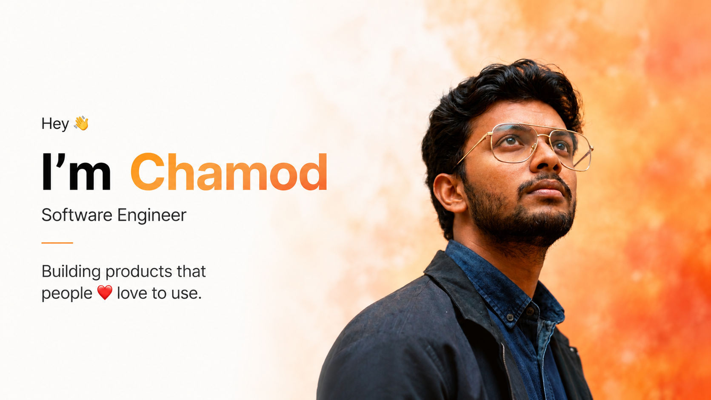

#

I make elegantly professional **📱 cross-platform mobile apps** and **🌍 full-stack web apps**, and also capture moments as a **📸 professional wedding photographer** 🎨

- ✈️ Actively looking for software engineering internships & freelance opportunities
- 💼 Check out my flagship project: **Kuliya** (Peer-to-Peer Rental Marketplace on App Store & Google Play)
- 🎓 Pursuing B.Sc. (Hons) in Software Engineering at Saegis Campus
- 🛠️ Building with React Native, Expo, java, spring-boot, Appwrite, Node.js, Firebase and Mapbox
- 📸 Managing digital media and photography via **Weddings by Abey** & **PictureMaster lk**
- 🎉 Let's connect on [LinkedIn](https://www.linkedin.com/in/chamod-abeywickramage/))
- 📭 Contact me: hello@abeylabs.dev

🕵 Take a look at my repositories and let's get in touch!

&nbsp;&nbsp;&nbsp;&nbsp;
&nbsp;&nbsp;&nbsp;&nbsp;

